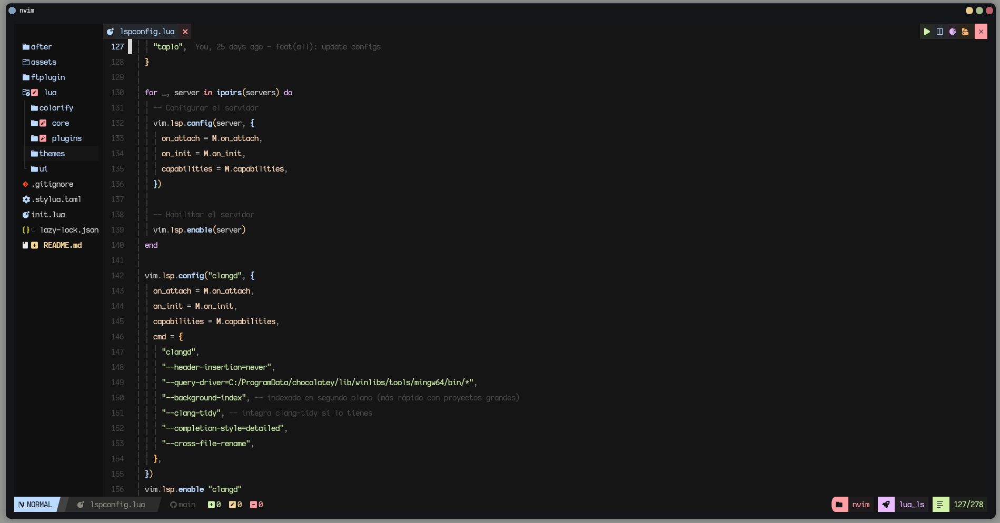
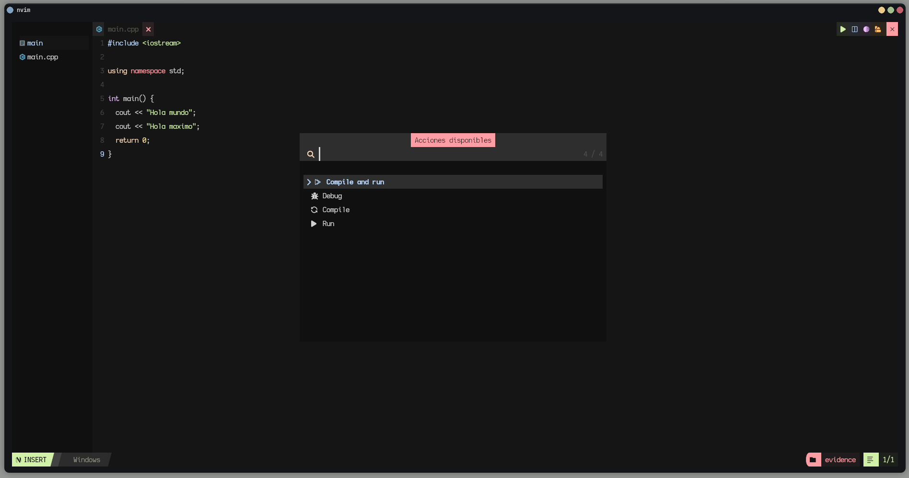
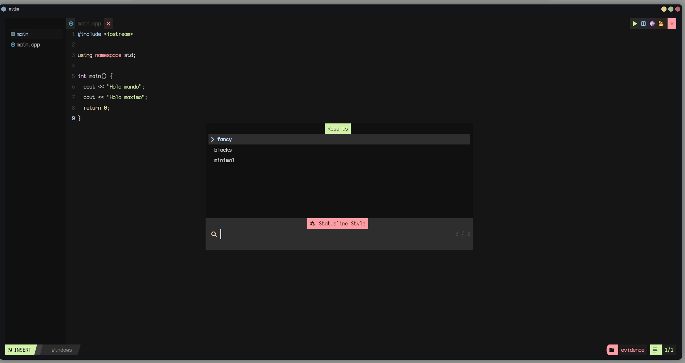
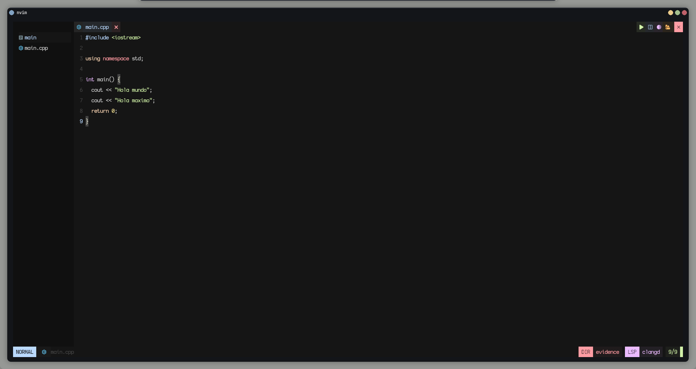

# 🧠 Neovim Config

> Una configuración personalizada de Neovim pensada para devs que quieren un entorno rápido, modular y potente sin perder elegancia. Minimalismo funcional, pero con toda la artillería lista para codear a gusto.

---

## 🚀 Instalación

### Linux 

```bash
# Cloná el repo en tu configuración de Neovim
mv ~/.config/nvim ~/.config/nvim_backup   # (opcional, por si querés guardar la anterior)
git clone https://github.com/rosasrias/Neovim ~/.config/nvim

# Entrá a Neovim y dejá que se instalen los plugins
nvim
```

### Windows

```bash 

# (Opcional) Hacé un respaldo de tu configuración actual
Rename-Item $env:LOCALAPPDATA\nvim "$env:LOCALAPPDATA\nvim_backup"

# Cloná el repositorio con mi configuración
git clone https://github.com/rosasrias/Neovim $env:LOCALAPPDATA\nvim

# Iniciá Neovim para instalar los plugins
nvim
```

> 💡 Requiere tener instalado **Neovim >= 0.9**, **git**, y un **gestor de plugins compatible con lazy-loading** (ya viene configurado en esta setup).

---

## ⚙️ Estructura del Proyecto

Esta config está dividida de forma modular para mantener claridad y escalabilidad:

```
~/.config/nvim
├── init.lua                # Punto de entrada principal
├── lua/
│   ├── core/               # Configuración base: opciones, mappings, autocommands, etc.
│   ├── plugins/            # Plugins organizados por tipo (editor, debug, ui, etc.)
│   ├── colorify/           # Módulo visual (siduck de NvChad)
│   └── ...                 # Otros módulos personalizados
├── ftplugin/               # Configs por tipo de archivo
└── after/                  # Overrides y ajustes específicos
```

Todo está separado por responsabilidad — nada de mezclar opciones, plugins y mappings en un solo archivo gigante 😎

---

## 🧩 Plugins Destacados

### 🧠 Core / Editor

* **Treesitter** → Syntax highlighting inteligente y estructurado.
* **Todo Comments** → Para marcar pendientes y recordatorios inline.
* **Autopairs / Comments** → Pequeños helpers de escritura que ahorran tiempo.

### 🪄 UI / Experiencia

* **Colorify** → Gestión visual de colores inspirada en NvChad.
* **Minty / Typr** → Plugins visuales para mejorar feedback al escribir.

### 🐞 Debug / Dev Tools

* Configuración completa de **adapters DAP** (para JS, Python, Go, PHP, Java, etc.).
* Adapters configurados en `lua/plugins/debug/adapters/` para debugging multi-lenguaje.

### 🧰 Otros

* Mappings inteligentes para moverte, buscar y abrir archivos rápido.
* Configs específicas por lenguaje en `ftplugin/`.

---

## 🎨 Temas y Apariencia

El esquema de colores y los highlights se manejan desde el módulo `themes/`, que controla dinámicamente los tonos del editor.

> Podés personalizar los colores o temas editando `lua/themes/schemes/*.lua`.

---

## ⌨️ Keybindings

Todos los keymaps están centralizados en `lua/core/mappings.lua`. Algunos destacados:

* `<leader>ff` → Buscar archivos.
* `<leader>fg` → Buscar texto global.
* `<leader>dd` → Abrir debugger.
* `<leader>tt` → Mostrar TODOs.

> 🧩 Podés redefinir o añadir tus propios bindings ahí sin miedo, todo está desacoplado.

---

## 💡 Tips de Uso

* Si es tu primera vez con Neovim, corré `:checkhealth` para verificar dependencias.
* El gestor de plugins se encarga del lazy loading — los plugins cargan solo cuando se necesitan.
* Mantené limpio tu entorno con `:Lazy clean` cada tanto.

---

## 📸 Capturas





--- 
## 🧠 Autocompletado CSS en styled-components con Neovim

Para tener autocompletado de CSS dentro de template literals de styled-components usando JSX/TSX en Neovim, necesitamos:

- typescript-tools.nvim

- typescript

- typescript-styled-plugin

![NOTA:] NO usar typescript-language-server en paralelo

### Configuración en Neovim

Instalar typescript-tools.nvim:
```lua
{
  "pmizio/typescript-tools.nvim",
  dependencies = { "nvim-lua/plenary.nvim" },
  opts = {
    filetypes = {
      "javascript",
      "javascriptreact",
      "typescript",
      "typescriptreact",
    },
    settings = {
      tsserver_plugins = {
        "typescript-styled-plugin",
      },
    },
  },
}
```

![Alert]⚠  Importante: No usar ts_ls (typescript-language-server) al mismo tiempo.

Verificar con:

```bash 
:LspInfo
```


Debe aparecer solo:

typescript-tools
2️⃣ Dependencias necesarias en cada proyecto

En la raíz del proyecto:

npm install --save-dev typescript
npm install --save-dev typescript-styled-plugin

Esto es obligatorio porque:

typescript-tools necesita tsserver

tsserver viene dentro del paquete typescript

El plugin styled necesita estar instalado en el proyecto

3️⃣ Verificación

Podés verificar que TypeScript está instalado con:

npx tsc --version

Si devuelve una versión → todo ok.

4️⃣ Resultado esperado

En un archivo .jsx o .tsx:

const Box = styled.div`
  displ
`

Debería autocompletar:

display

Con sugerencias reales del CSS Language Service.

🧱 Arquitectura del flujo

Tree-sitter → highlighting

typescript-tools → levanta tsserver

tsserver + typescript-styled-plugin → entiende CSS dentro de template literals

nvim-cmp → muestra el autocomplete

Cada pieza cumple un rol. Si falta una, se rompe la cadena.


---

## 🧱 Filosofía

Este setup sigue la idea de **"modularidad ante todo"**:

> Cada parte cumple su rol. Si algo falla, lo arreglás sin romper el resto.

Ideal para devs que quieren una base sólida sobre la que construir su propio entorno.

---

## 🤝 Créditos

Inspirado en ideas de [siduck (NvChad)](https://github.com/NvChad/NvChad) y en muchas horas de tunear Neovim hasta dejarlo justo como me gusta.

---

**Hecho con ❤️ y un poco de café.**

